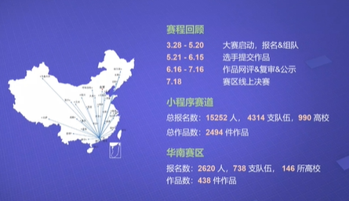

# 一.小程序二维码

此小程序获得了[2020中国微信官方小程序大赛](https://developers.weixin.qq.com/community/competition)华南赛区二等奖🎉

> - 一等奖：5%
> - 二等奖：10%
> - 三等奖：15%
>
> 电子证书还没开放，后续再补充😅

# 二.在开发之前

​	这个项目原本是结合物联网硬件指纹和人脸识别的一款实验室出入管理的项目，主要也是为诸如**中国大学生计算机设计大赛，挑战杯，互联网+**等比赛准备的。我在三人团队中担任的职责是**小程序前后端开发**，之后恰巧看到这个微信小程序比赛的时候就想着拿来参赛了，当然线下的硬件只能用模拟的方式去进行，这也造成了评委体验时对我的小程序有点懵的状况，在大家都评审开始的时候我的小程序还没老师来用:neutral_face:，得亏我反馈并说明后才有老师使用(这个后面再说)。

# 三.关于小程序&需求分析

​	实验室作为安全性较高的重要封闭场所，对于其它诸如公共封闭场所教室，办公室等场所，实验室的安全性，人员限制性，人员出入管理更为重要。某些实验室还是用着**古老的人员登记表和进入前提前报备管理员**，所以为了使实验室的管理，透明化，智能化，方便化，我们将管理系统放在移动端小程序上，无论是发布公告，管理人员，控制实验室开关，查看实验室人员情况等都能快速掌握。

​	对于普通用户来说，查看实验室开放状态，申请进入实验室，查看在某间实验室的时长和实验室公告，查看自己的日志，以及时长排行榜等。

​	在安全性方面，实验室出入采用指纹和人脸识别，生物识别中的人脸识别及指纹识别，利用其唯一性，可采集性和稳定性。唯一性指的是特征是独一无二的，每个人所有属于自己的唯一属性；可采集性指的是易于被采集；稳定性指的是不会轻易地被外在或内在因素改变。其特征更具有安全性、可靠性和有效性。

​	在国内已有类似的通过指纹及人脸等技术，对开发性活动室或实验室实现智能化的管理，类似的研究已趋近成熟，但是做成H5端和APP不够方便，且大材小用，相对小程序这种轻量级的还是不足。

# 三.技术方案

## 3.1前端(小程序端)

> - 使用了第三方组件库ColorUi,uView组件作为前端设计的组件库
> - IDE：微信开发者工具，HbuilderX
> - 框架：[uniapp](https://uniapp.dcloud.io/)(一款能发布到多端的Vue框架)，并没有用开发者工具去写，因为开发者工具的语法微信自定义太多了，按照[uniapp](https://ask.dcloud.net.cn/article/35947)官方原话来说，就是不伦不类的语法:anger:，两个我都有试过，自己的确更喜欢接近Vue原生的语法。在HbuilderX写好后能自动编译在开发者工具。

## 3.2后端

> - 服务器：阿里云，腾讯云
> - 框架：SpringBoot，SpringCloud简单部署，Mybatis
> - 云函数：腾讯云云开发(获取openid，发送腾讯云短信，发送订阅消息等)
> - 数据库：Mysql5.7
> - 环境：java1.8
> - IDE：IDEA

​	后端采用的SSM框架和spring的微服务使业务模块化。而使用云函数是为了方便地获取用户openid以及发送订阅消息

`获取openid`

`订阅消息`

## 3.3硬件

> - 树莓派，Arduino平台，指纹器，摄像头
> - 腾讯云物联网开发平台

# 4.页面功能展示说明

​	共有5个页面，与底部dock栏一一对应

> 1. 首页
> 2. 日志
> 3. 仪表盘
> 4. 排行榜
> 5. 我的

## 4.1首页

​	首页主要是展示目前所在实验室的状态，有进入的时长，这间教室的出入日志，成员，公告，在线人数以及文件等。

  <table><tr>            </tr></table>

​	如果此时不在实验室，则可以`模拟选择教室进入`，并发送打卡通知，进入实验室前会判定你是否在其他实验室，如果在就提醒要先离开那间实验室

  <table><tr>           </tr></table>

之后可以点击右下角按钮`模拟退出实验室`

  <table><tr>           </tr></table>

## 4.2日志

根据时间逆序查看自己的日志，还可以根据日期时间段进行筛选

  <table><tr>           </tr></table>

点击我的实验室可以查看我去过的实验室，点击卡片可以看到我在这间实验室的日志

  <table><tr>           </tr></table>

## 4.3仪表盘

权限说明

> - 超级管理员：可以查看所有实验室，用户，日志，增加关闭教室，赋予用户为某个实验室的管理员，撤销某个实验室的管理员等等
> - 管理员：能查看自己管理的实验室日志用户等，能发布公告在自己管理的实验室，总之基于自己管理的实验室。
> - 普通用户：其实就理解为没有管理实验室的用户，可以查看自己的日志，自己所在教室的动态以及活跃时长排行榜

  <table><tr>            </tr></table>

## 4.4排行榜

排行榜类似`微信运动`，可以查看目前谁的活跃时长最高，每天都会重新算

## 4.5我的

我的界面，需要在这里实名手机绑定，在学校用基本调用接口输入学号密码，但这里为了安全性只能模拟用手机绑定。

  <table><tr>            </tr></table>

# 5.原文地址

https://wiki.lifeisgg.online/archives/MyProject-AttendanceMiniprogram/

